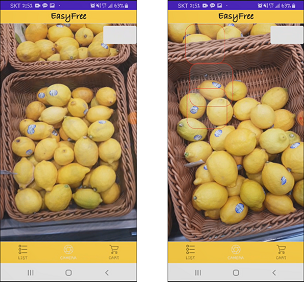
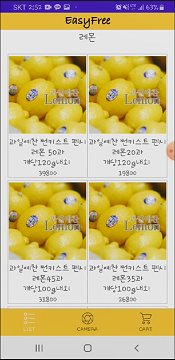
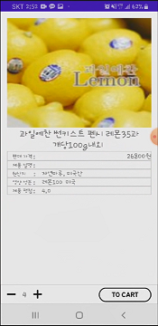
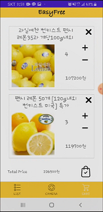

# [EasyFree] Object Detection을 이용한 핸드프리 쇼핑 앱

**2020 인공지능을 활용한 자연어처리과정 Final Project**

------

#### 프로젝트 개요

기업이 온라인을 통해 축적한 기술이나 데이터를 상품 조달 등에 적용해 오프라인으로 사업을 확대하는 신규 Biz 플랫폼, Online for Offline(O4O)

> SLOGAN : Easy &Fun shopping, Hands Free (Easy Free)

오프라인에서는 쇼핑하는 재미를, 온라인에서는 고객의 불편을 해소하는 EasyFree 제안


#### 프로젝트 목표

‘Object Detection’을 활용하여 모바일에서 제품 리스트, 원산지, 성분 정보를 확인하고 주문을 처리할 수 있는 쇼핑 앱 개발


#### 활용방안 & 기대효과


1. 고객이 장바구니를 들고 직접 물건을 가지고 가야하는 불편 해소
2. 고객에게 제품 정보나 연관 물품을 스마트폰으로 제공
3. 고객 구매 데이터를 수집, 분석, 마케팅에 활용
4. QR 코드를 통한 제품 인식 가능

------

### Project Download

```
git clone 'https://github.com/EasyFree-Project/EasyFree-Android.git'
```


### 1. 사용한 Package

#### 1.1 Camera Surface View

**[참고 사이트][https://argc.tistory.com/236?category=699460]**

- 개발하는데 참고한 사이트는 아니지만 정리가 잘 되어있음


#### 1.2 Multer

[Github Link][https://github.com/expressjs/multer]

- Android ↔ Node.js 간 파일 송수신을 위한 패키지

[Android, Node.js Example][https://www.journaldev.com/23709/android-image-uploading-with-retrofit-and-node-js]


### 2. Application Screenshot

#### 2.1 Login

- Login, Signup


#### 2.2 Object Detecting

- Use camera
- Detect object
- Get product list from category



#### 2.3 Product List

- Show Product List
- Get product detail information




#### 2.4 Product Detail

- Show Product Detail Information
- Change quantity
- Add to cart



#### 2.5 Basket

- Purchase items in basket




> Reference
>
> 1. [Notion](https://www.notion.so/EasyFree-046515e567a74555b929ca4168579e16)
> 2. GitHub ([Android](https://github.com/EasyFree-Project/EasyFree-Android), [iOS](https://github.com/EasyFree-Project/EasyFree-iOS), [Backend](https://github.com/EasyFree-Project/EasyFree-Backend))
> 3. [Application (Playstore)](https://play.google.com/store/apps/details?id=com.sosin.easyfree)
> 4. [최종 보고서](https://drive.google.com/file/d/1pS-XlnIR-GEnt_eicvVs0ndYX__znosm/view?usp=sharing)
